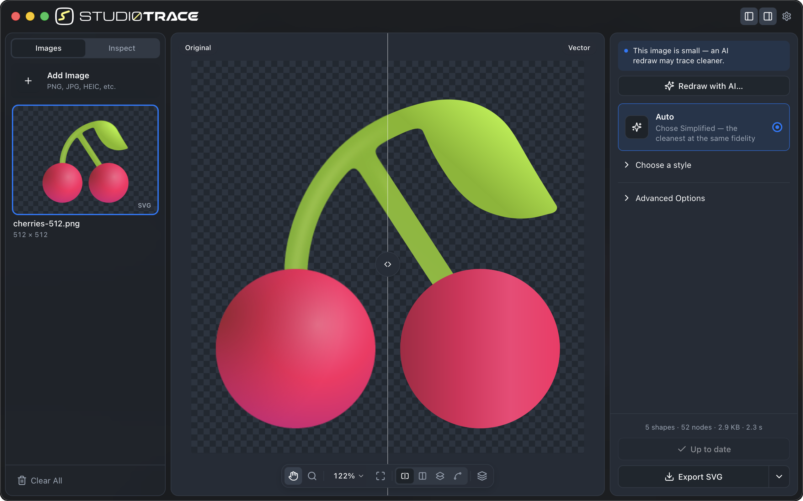
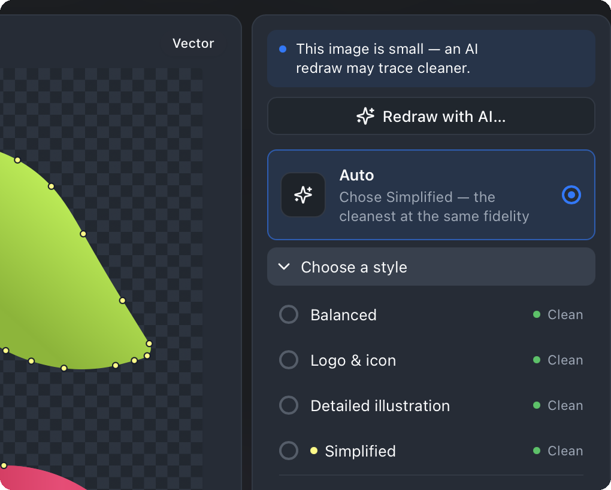
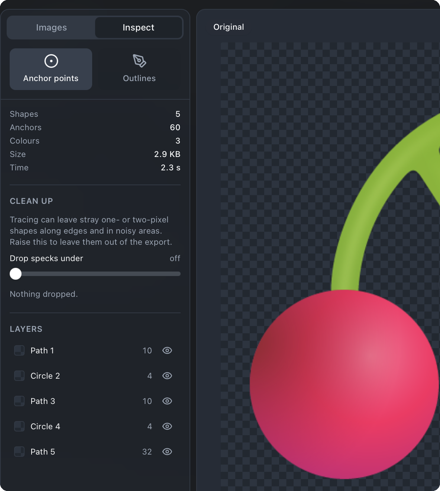
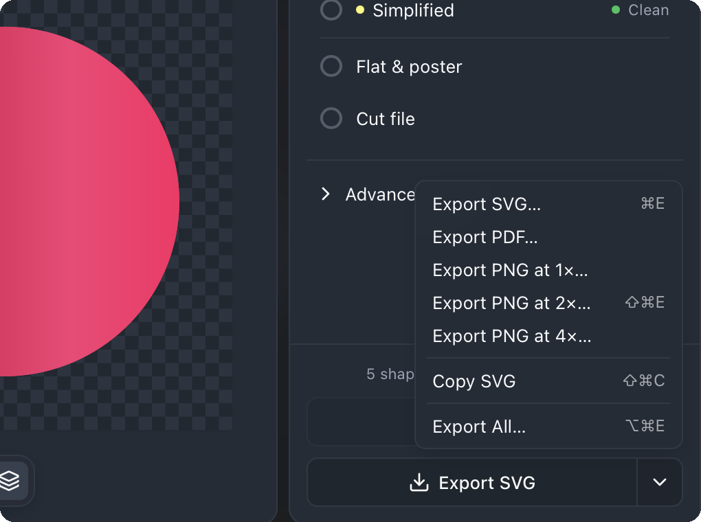
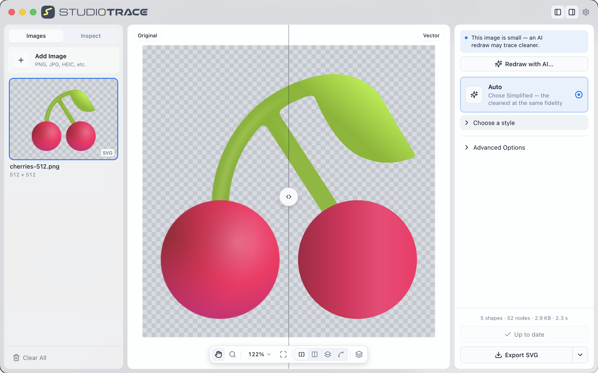

<p align="center">
  
</p>

<h1 align="center">
  <picture>
    <source media="(prefers-color-scheme: dark)" srcset="frontend/public/brand/wordmark-dark.png">
    
  </picture>
</h1>

<p align="center"><strong>Turn images into clean vectors.</strong></p>

<p align="center">
  A Mac app that traces logos, icons and illustrations into SVG you would actually ship:
  real gradients and drop shadows, straight edges that stay straight, circles that are circles,
  and neighbouring shapes that meet without a hairline. Everything runs on your Mac. Nothing is uploaded.
</p>

<p align="center">
  <a href="https://github.com/timothynice/Studi0Trace/releases"></a>
  &nbsp;
  <a href="LICENSE"></a>
  &nbsp;
  
</p>

<p align="center">
  
</p>

## Why it traces better

Most tracers quantise an image into a few flat colours and outline the bands. Studi0Trace's engine, **Vexel**, reads the image the way a designer drew it:

- **Gradients and shadows come back as gradients and shadows.** A red-to-blue ramp is one shape with one `<linearGradient>`; a drop shadow is an SVG `<filter>` with the blur, offset and colour it was made with, not forty stacked bands.
- **Edges are placed at sub-pixel positions** from the anti-aliasing, so a straight edge is a straight line, a circle is a `<circle>`, a rounded rectangle is a `<rect rx>`, and a symmetric mark comes out exactly symmetric.
- **Neighbouring shapes share one edge.** The boundary is built once as a graph, so two shapes that touch are described by the same curve and there is never a hairline of background between them.

On the bench against two well-known open-source tracers, Vexel is the most faithful on 102 of 104 images, with a third of the paths and bytes:

| image class | Potrace | VTracer | **Vexel** |
|---|---|---|---|
| logo | 11.4 | 1.20 | **0.24** |
| flat art | 20.4 | 0.98 | **0.57** |
| gradient | 23.2 | 10.40 | **0.81** |
| shadow | 14.8 | 3.24 | **0.28** |

<sub>Mean CIEDE2000 colour error between the source and the rendered SVG; lower is better. Details and how to reproduce it are under [Under the hood](#under-the-hood).</sub>

## What you get

<table>
  <tr>
    <td width="50%" valign="top">
      
      <p><strong>Auto picks the style.</strong> Every image starts on Auto, which traces it four ways and keeps the cleanest result that is as faithful as the best. It tells you what it chose and why, and every other style's verdict is one click away.</p>
    </td>
    <td width="50%" valign="top">
      
      <p><strong>Inspect every shape.</strong> Anchor points and outlines over the canvas, a layer list with every shape's colour and node count, and a speck slider that drops the one-pixel shards tracing can leave, before they reach the export.</p>
    </td>
  </tr>
  <tr>
    <td width="50%" valign="top">
      
      <p><strong>Export what the next tool wants.</strong> SVG for the web and your editor, a vector PDF for print and Keynote, PNG at 1×, 2× or 4×, or the SVG straight onto the clipboard. Export All writes every traced image in one go.</p>
    </td>
    <td width="50%" valign="top">
      
      <p><strong>Made for the Mac.</strong> Light and dark appearances, the system accent, a draggable split and side-by-side, overlay and vector-only views, the keyboard for everything, and HEIC straight from Photos. Images never leave your Mac.</p>
    </td>
  </tr>
</table>

**Rough source? Redraw it first (optional).** A small, blurry or pixel-doubled image is the hardest thing to trace. Image ▸ Redraw with AI… shows an AI redraw against the original with a drift check, and only replaces the image when you say so. Your images stay on your Mac: nothing is uploaded unless you choose AI redraw, which sends that one image to OpenAI with your own API key. It is the only thing in the app that touches the network, and it is off until you turn it on.

<details>
<summary>AI redraw, in detail</summary>

A small, blurry or pixel-doubled image is the hardest
thing to trace. Image ▸ Redraw with AI… (also in the image's right-click menu and
the inspector, which suggests it for an image under 600 px or an exact 2× upscale)
sends that one image to OpenAI's image model with your own API key, billed to your
OpenAI account; the first time it asks for the key and keeps it in your Mac's
Keychain. The redraw may change shapes, spacing and colours, so it is always shown
against the original first — edges matched, colour shift and a verdict — and the
image changes only when you choose Use redraw. Image ▸ Revert to Original swaps
back. Settings ▸ AI redraw holds the key, the model (GPT Image 2 or 1.5), the
quality and the hint. Cancel Redraw abandons the request and any reply that still
arrives; an invalid key, an account out of credit, an organization OpenAI has not
verified for image models, a refusal, a timeout or no connection each say so and
leave the image as it was. No test calls OpenAI; `OPENAI_API_KEY=… cargo test -p
studi0trace-desktop --release -- --ignored live_redraw --nocapture` does, by hand.

</details>

## Get it

**Download** the latest `.dmg` from [Releases](https://github.com/timothynice/Studi0Trace/releases), open it and drag Studi0Trace to Applications. macOS 13 or later, Intel or Apple silicon. Free and MIT licensed.

Releases starting with **0.3.1** are signed with Developer ID and notarized by
Apple. macOS may ask you to confirm opening an app downloaded from the Internet;
no changes to your security settings are needed. If you downloaded the older
0.3.0 build and see “Apple could not verify” or “Not Opened,” replace it with the
latest release.

It opens PNG, JPEG, GIF, WebP, BMP, HEIC and TIFF, up to 2048 px a side, and
offers Downscale for larger ones. It is listed under Finder's Open With for those
types and never becomes their default app.

| Keys | Does |
|---|---|
| ⌘O | Open images |
| ⌘↩ | Generate Vector |
| ⌘. | Cancel Trace |
| ⌘E | Export SVG |
| ⇧⌘E | Export PNG at 2× |
| ⌥⌘E | Export All |
| ⌥⌘R | Show in Finder |
| ⇧⌘C | Copy SVG |
| ⌘1 – ⌘4 | Split, Side by Side, Overlay, Vector Only |
| ⌘+ / ⌘- | Zoom In / Zoom Out |
| ⌘0 | Actual Size |
| ⌘9 | Zoom to Fit |
| ⌃⌘S | Show or hide the sidebar |
| ⌥⌘I | Show or hide the inspector |
| ⌘⌫ | Remove Image |
| ⌘, | Settings |

<details>
<summary><strong>Build it from source</strong></summary>

Run it from source (needs Node ≥ 20 and Rust ≥ 1.90, <https://rustup.rs>):

```bash
cd frontend && npm ci                                  # the UI's dependencies, once per checkout
cd ../apps/desktop && npm ci && npm run dev            # the Tauri CLI; starts the frontend's Vite server itself
```

Build it:

```bash
cd apps/desktop && npm run build
# target/release/bundle/macos/Studi0Trace.app
# target/release/bundle/dmg/Studi0Trace_0.3.1_aarch64.dmg
npm run smoke                                          # opens a sample with the built app, as Finder does, and checks it traced
```

The first release build takes ten minutes or more (the workspace's release profile
is LTO with one codegen unit). The build embeds `frontend/dist`; `npm run build`
makes it first. The `.dmg` step styles its window by scripting Finder; where that
times out (no Automation permission for Finder, or no one logged in at the
screen) the build fails after the `.app` is made, and `CI=true npm run build`
makes the same `.dmg` with a plain window.

Local builds use an ad hoc signature. The distribution build uses
`npm run build:release` and requires Developer ID and notarization credentials;
see [macOS release signing](docs/macos-release-signing.md). GitHub's release
workflow uses that same command and uploads assets only after the app, updater
archive and disk image pass signature, notarization and Gatekeeper verification.

**Third-party notices.** `apps/desktop/src-tauri/resources/THIRD_PARTY_NOTICES.html`
is generated and committed, bundled into the app and shown by Help ▸
Acknowledgements. It lists the Rust crates (cargo-about) and the frontend's
production npm packages and font, with their licence texts. Regenerate it after a
dependency change with `bash apps/desktop/scripts/notices.sh` (needs
`cargo install cargo-about --locked --version 0.9.2 --features cli` and
`npm ci` in `frontend/`); the same lockfiles give the same bytes. A new licence in
the Rust tree fails the run until `apps/desktop/about.toml` accepts it.

</details>

## Under the hood

Studi0Trace is a Tauri 2 shell around a Rust core: image intake, the presets, the artifact scorecard and Auto are `crates/studi0trace-core`, and the tracing engine is `backend/vexel-rs`. Every trace runs in a child process, so a cancel is a kill and the window never waits. The Python service in `backend/` is the engine's reference implementation and the development harness, and **Vexel Bench** is the fidelity scoreboard every quality change is judged on.

```
apps/desktop/              Studi0Trace for Mac (Tauri 2)
crates/studi0trace-core/   Everything around the engine, in Rust: intake, presets, the scorecard, Auto
backend/vexel-rs/          Vexel's pipeline in Rust, built as an extension module for the bench
backend/                   FastAPI reference service + the Python Vexel + Vexel Bench   (Python ≥ 3.12)
frontend/                  The app's UI: React 18 + TS + Tailwind                      (Node ≥ 20)
```

The bench compares Vexel with **Potrace** (1-bit outlines) and **VTracer** (colour layers).

### Vexel

Vexel is built for logos, flat art and illustrations with gradients and soft
shadows. Instead of quantising colours and tracing bands, it:

1. finds discontinuities as *ridges* of the colour gradient (Canny-style
   non-maximum suppression), so steep smooth ramps stay whole and thin strokes
   keep their seeds;
2. merges regions by how well a **solid / linear / radial** colour model
   explains the union — closed-form least squares from moment statistics, so a
   red→blue gradient is one region and two flat tiles 6 ΔE apart are not;
3. reconstructs each region's fill as a solid, a multi-stop linear gradient or
   a radial gradient (stop-opacity for alpha ramps);
4. rescues thin features swallowed by a neighbour via per-region residuals,
   then joins gradient fragments that one real fill explains;
5. orders shapes by enclosure (painter's algorithm, seamless stacking);
6. builds the boundary **once, as a planar graph** — arcs between the junctions
   where three or more regions meet — so the edge two regions share is placed,
   fitted and emitted a single time and handed to both. Neighbours cannot
   describe it differently, so there is no hairline between them for the
   backdrop to show through, at any tolerance. A region that tapers to a point
   is carried past where the labels give out: below a pixel wide there is no
   pixel to hold it, so the stretch beyond is read as a mixture of three fills
   and the sliver handed back. Its tip is then a **cusp** — all three arcs share
   one tangent — so the boundary that carries on stays a single sweeping curve
   rather than taking a corner where the artwork has none;
7. places those arcs at **sub-pixel** positions inferred from anti-aliasing
   coverage, sharpens corners and junctions, keeps the outline G1 where a
   boundary runs on through a junction, fits circles/ellipses/rects and
   **rounded rectangles** (`<rect rx>`) as primitives and a run that is one
   circle as an **`A` arc**, fits every run between breaks **lines first** — straight runs
   from the residuals about their own line, cubics between them, kept when
   that costs no more segments than a curve — so a straight edge is emitted
   straight rather than as a cubic that bows, then makes lines that are meant
   to be **parallel, perpendicular or on an axis exactly so** across the whole
   boundary graph (`vexel/regularity.py`), traces a **small input with thin
   features at twice its size** and scales the drawing back (`vexel/upsample.py`),
   makes a **mirror- or rotationally
   symmetric** mark exactly so (`vexel/symmetry.py`), writes a **repeated shape
   once** and paints its copies with `<use>` (`vexel/reuse.py`), and
   otherwise G1 cubic Béziers — and, with **Render refinement** on, renders each
   edge's two shapes and nudges the curve until the pixels match the source;
8. recovers thin lines as **stroked centreline paths** (`fill="none"`,
   measured `stroke-width`, cap style read from the source) instead of
   filled slivers;
9. recognises **drop shadows, glows and inner shadows** as what they are — a
   blurred, offset, scaled copy of a shape's own alpha — recovers
   `(dx, dy, σ, colour, opacity)` and emits the SVG `<filter>` that regenerates
   them, instead of slicing the falloff into bands with lumpy iso-contour
   edges.

On the bench (synthetic corpus plus real Studi0 logos; mean CIEDE2000 ΔE,
lower is better):

| class | Potrace | VTracer | **Vexel** |
|---|---|---|---|
| logo | 11.4 | 1.20 | **0.24** |
| flat | 20.4 | 0.98 | **0.57** |
| gradient | 23.2 | 10.40 | **0.81** |
| shadow | 14.8 | 3.24 | **0.28** |

Vexel has the lowest ΔE on **102 of 104** corpus items, and gets there with far
less geometry: 8.0 paths and 5.3 KB per image on average against VTracer's 25.7
paths and 14.7 KB.

`seam_ppm` is the other number to watch: parts per million of the artwork that
the emitted shapes cover less than the source does. It is what the shared
boundary is for, and it does not show up in ΔE — a hairline between two shapes
is a handful of pixels in a frame, and sweeping `curve_tolerance` from 0.1 to
2.0 used to take the sub-pixel hole count on a 512 px logo from 397 to 19502
while moving `score` by 0.007.

### Vexel is Rust

The pipeline lives in `backend/vexel-rs/` and is built as an extension module.
It averages **0.21 s an image** against the Python implementation's 2.1 s —
**10.4× over the corpus**, and 15.8× on the logo class, where the two 768 px
real logos are. The Python pipeline is still in `engines/vexel/*.py`: it is the
reference the Rust one was ported from, the fallback when the extension is not
built, and the oracle `tools/diffcheck.py` compares every stage against.

Set `VEXEL_BACKEND=python` to force the reference, `rust` to require the
extension. The default is the extension when it imports.

Design, measurements and the two defects the port turned up —
`skimage.morphology.medial_axis` is seeded from the OS and so not reproducible,
and two corpus items were being scored on a lucky random sample — are in
`docs/superpowers/specs/2026-09-20-vexel-rust-port-design.md`.

Reproduce it yourself — the corpus is generated, not shipped:

```bash
cd backend
python -m bench generate            # rebuild the corpus from bench/synth.py
python -m bench run                 # every registered engine
```

Design and research notes: `docs/superpowers/specs/2026-09-17-vexel-engine-design.md`,
and `2026-09-20-vexel-rust-port-design.md` for the Rust implementation.

## Run it (the development harness)

The FastAPI server and the browser build are kept for developing the app and
the engine; the Mac app does not need them.

Backend (needs the `potrace` binary: `brew install potrace` / `apt install
potrace`, and a Rust toolchain for Vexel: <https://rustup.rs>):

```bash
cd backend
uv venv .venv && uv pip install -p .venv/bin/python -e '.[dev]'
.venv/bin/python -m maturin develop --release -m vexel-rs/Cargo.toml   # Vexel
.venv/bin/uvicorn studi0trace.main:app --reload        # http://localhost:8000
```

Without the last step everything still works — Vexel falls back to its Python
implementation and traces about ten times slower.

Frontend:

```bash
cd frontend
npm ci
npm run dev                                            # http://localhost:5173
```

`frontend/.env.local` points the app at `http://localhost:8000`.

## Tests

```bash
cd backend           && .venv/bin/python -m pytest
cargo test --workspace --release                       # the engine and the core (Rust >= 1.88; the desktop crate needs 1.90)
cd backend/vexel-rs  && cargo test                     # the engine alone
cd frontend          && npm run test:run
```

The core's golden fixtures (`crates/studi0trace-core/tests/fixtures`) were
exported from the Python on macOS arm64 (`cd backend && .venv/bin/python -m
tools.export_core_fixtures`), and results that go through the system's libm are
compared to the bit only there. `STUDI0TRACE_FORCE_TOLERANT=1 cargo test
--workspace --release` runs the tolerant comparison, the one every other machine
gets, on any machine.

The backend suite includes a concurrency test (two 0.4 s traces must finish in
< 0.7 s) and asserts CORS headers on every error path, including 500s. It runs
against whichever Vexel backend is installed; `VEXEL_BACKEND=python pytest`
exercises the other one.

`tools/diffcheck.py` compares the two Vexel implementations stage by stage over
the whole corpus — the partition's labels to the last float32 bit, the fills by
what they paint:

```bash
cd backend && .venv/bin/python -m tools.diffcheck            # every stage
.venv/bin/python -m tools.diffcheck labels0 --filter 128     # one stage, some items
```

Its `scorecard` stage holds the Rust core's scorecard (`crates/studi0trace-core`)
to `studi0trace/imaging/quality.py` on a trace of every corpus item, so it needs
the core built as a Python extension, beside `vexel_rs` and under its own name:

```bash
cd backend && VIRTUAL_ENV=$PWD/.venv .venv/bin/python -m maturin develop --release \
    -m ../crates/studi0trace-core/Cargo.toml --features python
.venv/bin/python -m tools.diffcheck scorecard
```

Without it the stage fails with this command rather than skipping, and the
core's tests in `backend/tests/test_core_scorecard.py` are skipped.

## API

| Route | Purpose |
|---|---|
| `GET /health` | `{status, version, engines}` |
| `GET /engines` | Each engine's `id`, `label`, `description`, JSON Schema `params` and `defaults`. The UI renders every control from this — adding an engine or a parameter needs no frontend change. |
| `GET /presets` | Auto first, then named parameter bundles: `id`, `label`, `engine`, `description`, `detail` (what it measurably costs, from the bench), `params`, `kind` (`auto` or `preset`) and `auto_candidate`. A preset layers over the engine's **defaults**, never over current values. The bundles are `studi0trace/engines/presets.json`, one file the Python server and the Rust core both read (the core embeds it and `preset_details.json`; re-export its fixtures after changing either). Auto has no params; it is asked for with `auto=true`. The `detail` lines are measured, never hand-written: `VEXEL_BACKEND=rust RAYON_NUM_THREADS=1 .venv/bin/python -m bench.presets_eval --out DIR --fast --workers 3 --write-details` rewrites `studi0trace/engines/preset_details.json` from a run over the whole corpus. |
| `POST /uploads` | multipart `file` → `{image_id, width, height, format}`. Validated once and kept server-side (LRU, sliding 30 min TTL) so re-tracing while tuning doesn't re-send the file. |
| `POST /vectorize` | multipart: `image_id` **or** `file`, `parameters` (JSON keyed by engine id), `engines` (comma list; default all). Returns `results.{engine}.{svg, elapsed_ms, stats | error}`, `image_id`, `width`, `height`. Expired id → 404 `image_expired`; the client re-uploads and retries once. With `auto=true`, each selected engine that has Auto candidates (Vexel: Balanced, Logo & icon, Detailed, Simplified) is traced once per candidate, concurrently, and each trace is scored against the source (`studi0trace/imaging/quality.py`: ΔE, edge F1, the artifact scorecard); `auto.{engine}` then holds every candidate's `svg`, `stats`, `parameters` and `scores`, the `pick` and a `reason`, and `results.{engine}` is the pick. The rule (`studi0trace/auto.py`): the lowest artifact index among candidates within ΔE +max(0.15, 30 %) and edge F1 −0.02 of the best, ties to fewer shapes. A failing candidate is reported and left out; `auto=true` with no engine that has candidates → 400 `auto_unavailable`. |

Uploads are sniffed with Pillow (client `Content-Type` is ignored), limited by
`MAX_UPLOAD_BYTES` (20 MB), `MAX_IMAGE_SIDE` (2048 px a side) and
`MAX_IMAGE_PIXELS` (40 MP), and normalised to
RGBA — transparency reaches every engine. Errors carry a stable `code`.
Env: `ALLOWED_ORIGINS` (comma list), `MAX_UPLOAD_CACHE_BYTES` (256 MB),
`UPLOAD_TTL_SECONDS` (1800). The upload cache is per process; with several
workers the client's re-upload fallback keeps things correct, just slower.

## Frontend

Single workspace: drop / paste / browse an image (or pick a sample), then tune.
Every new image starts on **Auto**: the preset list says which preset Auto chose
and why, and each candidate's row shows that image's own result (thumbnail, ΔE,
shape count, clean or the issues found). Every candidate's trace comes back with
the Auto run, so clicking one shows it at once; moving a control or picking a
preset leaves Auto.
Controls are generated from `GET /engines` (`ui.control`, `ui.group`, `ui.label`,
`ui.step`, `ui.unit` hints on each Pydantic field). Parameter changes are
debounced 250 ms, superseded requests are aborted, and the previous result stays
on screen while the next one loads. Views: split (draggable divider), side by
side, overlay (opacity), vector; shared zoom/pan keeps raster and SVG
pixel-aligned. Download SVG or PNG (1×/2×/4×, rendered client-side), copy SVG,
and "Compare all engines" for a stats table across engines. System/light/dark
theme, persisted. No service worker.

Tests: Vitest + Testing Library + MSW (`npm run test:run`). A custom Vitest
environment (`src/test/env.ts`) keeps Node's fetch globals under jsdom so MSW
sees real multipart bodies and AbortSignals.

## The engine seam

```python
class Engine(Protocol):
    id: str; label: str; description: str
    Params: type[pydantic.BaseModel]          # bounds, defaults, UI hints, schema
    def trace(self, image: TraceInput, params: BaseModel) -> TraceResult
```

`trace()` is synchronous and CPU-bound; the API runs it in a worker thread.
`TraceInput.image` is RGBA. Return through `engines.base.finish()` so the SVG
gets a source-sized `viewBox` and stats. Register with
`registry.register(MyEngine())` — see `engines/potrace.py` for a 90-line example.

## Vexel Bench

```bash
cd backend
.venv/bin/python -m bench generate                       # synthetic corpus → bench/corpus
.venv/bin/python -m bench run --engines potrace,vtracer  # → bench/reports/<ts>/index.html
.venv/bin/python -m bench compare bench/baselines/vtracer.json bench/reports/<ts>/results.json
.venv/bin/python -m bench sweep --engine vtracer --param color_precision=3:8
```

Every engine's SVG is rasterised back with resvg and scored against the source:
SSIM, CIEDE2000 ΔE (mean/p95), edge F1, alpha error, a **banding index** for
gradient stair-stepping, plus path/node/byte counts and time. Classes:
`logo`, `flat`, `gradient`, `shadow`. Composite weights live in
`bench/config.py` and are echoed into every `results.json`.

Two more sets sit beside the corpus, each run with `--corpus`: `bench/heldout`
(open-source emoji never used while developing Vexel) and `bench/degraded`
(`python -m bench.degraded generate`): thirteen vector-truth sources rendered
with the damage real uploads carry — `nn2x` (an exact nearest-neighbour 2×
upscale), `sharpen` (unsharp-mask rims and halos), `small` (176 px, strokes
under 2 px) and `combo` (`nn2x` and `sharpen` together plus ground noise, at
the full size). `sharpen`'s dark rim and light halo appear only against an
opaque ground; on a transparent ground the unsharp mask over straight RGB
brightens the rim instead. A fix aimed at a
degraded input is judged there on both sides, where it helps and where it
costs; `tools/qloop.sh full` gates all three sets per item.

## Design docs

`docs/superpowers/specs/` holds the approved designs; `docs/superpowers/plans/`
the implementation plans.

## Contributing

See [CONTRIBUTING.md](CONTRIBUTING.md). The short version: a tracing quality
change is not an improvement until `python -m bench compare` says so, and
baselines move only deliberately.

## Licence

MIT — see [LICENSE](LICENSE).
