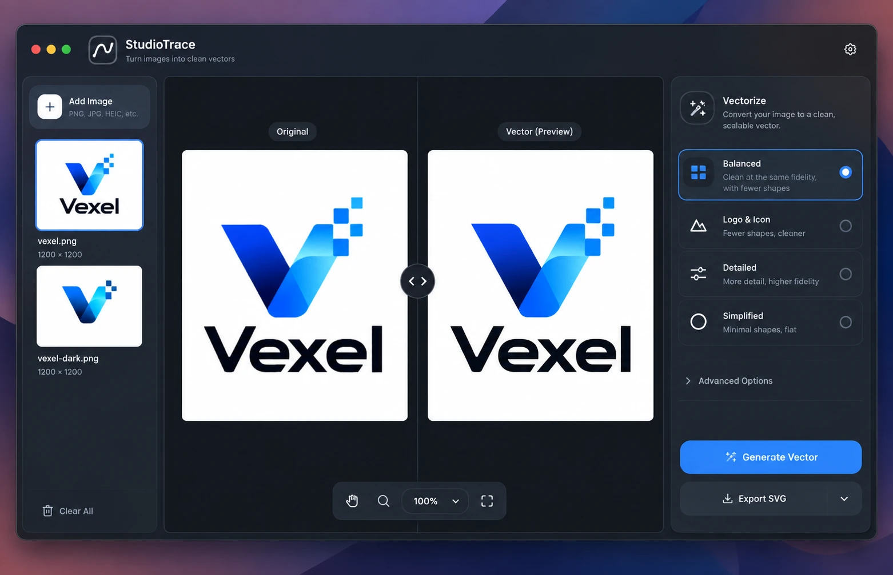

# Studi0Trace for Mac: design

2026-10-02. Plan 2 of the local-app roadmap (`2026-09-24-studi0trace-local-app-design.md`).
The Mac app is the product: Tauri 2 around `crates/studi0trace-core`, with the React UI of
`frontend/` reshaped from a web page into a Mac window. Tim asked for this to be designed and
built autonomously from his concept (`assets/2026-10-02-mac-app-concept.webp`); the brand and
the style are kept, the feel is to be a Mac app's, not a web app's.



## Decisions

| question | decision | why |
|---|---|---|
| Platform | macOS 13 and later, Apple silicon (`aarch64-apple-darwin`) | Mac only (2026-10-02); a universal build is plan 4's choice |
| Shell | Tauri **2** (crate 2.12, CLI 2.12), not the 3.0 alphas | stable; the core links in-process |
| Name | **Studi0Trace** (the concept's "StudioTrace" is the concept's), bundle id `com.studi0.trace`, version 0.3.0 | the brand stays |
| One UI | `frontend/` becomes the Mac UI. Run in a browser it is a development harness over the Python server (HTTP transport, web fallbacks); there is no second, web layout | Mac only; plan 4 retires the server |
| Where a trace runs | in a **worker process**: the app's own binary run as `studi0trace-desktop --trace-worker`, one per trace, killed to cancel | a trace of a 2048 px image takes 1.5 minutes and 7.5 GB and the engine cannot be cancelled; a child process is cancelled at once, gives its memory back when it exits, and its crash (an abort, a stack overflow, out of memory) is a failed trace, not a closed window. The engine and the core do not change |
| How many at once | one worker at a time, in a queue: a newer request for the same image replaces the queued one or kills the running one | Auto at 2048 px peaks near 11 GB; two at once is a swapping Mac |
| When it traces | **Generate** (⌘↩) traces the selected image. After that, a change of preset or setting re-traces by itself while the image's last trace took under 2 s, and otherwise turns the button into **Update** | live tuning where it is cheap, no surprise minute-long traces where it is not |
| Progress | the phase (Queued, Tracing, Trying 4 presets) and the seconds elapsed, with **Cancel** | the engine reports nothing finer, and plan 2 does not change it |
| New images | open on **Auto**, untraced until Generate; Settings can trace new images at once | the concept's explicit Generate; Auto is still where every image starts |
| Too large | an image over the 2048 px cap is listed with **Downscale to 2048 px**, which makes a scaled copy (`sips -Z 2048`) and adds that | a photo off a phone is 4032 px; refusing it outright is a web form's answer |
| HEIC, HEIF, TIFF | converted to PNG by macOS (`sips`) in the shell before the core sees them | the core has no C decoders and stays that way; every Mac has ImageIO |
| Files | the window opens files, never writes where the page says: Rust shows the panels, picks the names and writes. Export goes to a save panel or, by setting, next to the original (`logo.svg`, `logo 2.svg`, as Finder names copies) | a webview that can name paths can overwrite anything |
| Look | brand tokens and the mark kept; the macOS accent colour (`AccentColor`, blue by default, as in the concept) for selection, focus and the primary button; the system font (SF Pro) for the interface at 13 px, Poppins for the wordmark; AppKit densities (28 px controls, 36 px primary); vibrancy behind the sidebar; appearance follows the system | what makes a window read as a Mac app is mostly type, density, chrome and behaviour, and the brand is in the mark, the name and the palette |

## Architecture

```
Cargo.toml (workspace)        + apps/desktop/src-tauri
apps/desktop/
  package.json                @tauri-apps/cli; `npm run dev`, `npm run build`
  src-tauri/
    tauri.conf.json           window, bundle (icon, file associations), plugins
    capabilities/default.json
    icons/                    made from icons/icon.svg by `tauri icon`
    src/main.rs               `--trace-worker` → worker::main(); else the app
    src/lib.rs                Builder: plugins, state, commands, menu, run events
    src/store.rs              the open images: id → source bytes, path, name (byte-capped LRU)
    src/intake.rs             open a path: read, convert HEIC/HEIF/TIFF, downscale; then Core::upload
    src/worker.rs             the worker's side: read a job from stdin, Core::vectorize, write JSON
    src/queue.rs              the app's side: one worker at a time, supersede, cancel, crash → error
    src/export.rs             save panel, next-to-original names, write, reveal in Finder
    src/menu.rs               the menu bar and its events
    src/commands.rs           the #[tauri::command]s the UI invokes
frontend/src/
  platform/                   what differs between the Mac app and a browser
    index.ts                  `platform` = native or web, chosen once (`isTauri()`)
    native.ts                 invoke, dialogs, menu events, drag and drop, settings store
    web.ts                    fetch to the Python server, <input type=file>, downloads, localStorage
  lib/api.ts                  types and the HTTP client (web.ts uses it); unchanged contract
  state/library.ts            the images in the sidebar, their settings, traces and jobs
  components/                 TitleBar, Sidebar, Viewer (+ Toolbar), Inspector, Settings, …
```

The UI calls the same five operations it calls today (describe, presets, upload, vectorize,
health) through `platform`, and gets the same JSON: `Core` returns the FastAPI shapes, errors
included (`ApiError::status` and `response_body()` become an `ApiError` in the UI with the same
`code` and `message`). Everything else the Mac app adds (open, export, menus, settings, recent
files) is also behind `platform`, with a browser fallback where one makes sense.

### The trace worker

`main()` checks its arguments before Tauri starts: `--trace-worker` runs `worker::main()`,
which never initialises AppKit (so it never shows in the Dock), reads one job, answers, exits.

- **Job, on stdin:** one JSON line `{"parameters": <the vexel parameters>, "auto": bool,
  "bytes": N}`, then the N bytes of the (already converted) source file.
- **Answer, on stdout:** one JSON line, `{"ok": <Core::vectorize's JSON>}` or
  `{"err": {"status": 422, "body": {...}}}`. The worker builds its own `Core`, uploads the
  bytes and vectorizes; the intake already passed in the app, so decoding again costs a few
  tens of milliseconds against seconds of tracing.
- **The app's side (`queue.rs`):** a job is `(image_id, key, parameters, auto)`. One runs at a
  time; a job for an image whose job is queued replaces it, and one for an image whose job is
  running kills that worker first. `cancel(job)` kills or dequeues. A worker that exits without
  an answer (killed by the user: `cancelled`; by a signal, a non-zero status or a broken
  answer: `engine_crashed`, with what it wrote to stderr in the log) is an error with a code,
  as every other failure is.
- **Tests** reach the worker through a hook honoured only with `STUDI0TRACE_TEST_HOOKS=1`: a
  job may ask the worker to sleep or to abort, so cancelling and crashing are tested on the
  real binary (`CARGO_BIN_EXE_studi0trace-desktop`).

### Opening images

A path comes from the open panel (⌘O), a drop from Finder, **Open With** / a drop on the Dock
icon (`RunEvent::Opened`, file associations for PNG, JPEG, GIF, WebP, BMP, HEIC, HEIF, TIFF),
or Open Recent. `intake.rs` reads it, converts HEIC/HEIF/TIFF to PNG with `sips` (EXIF
orientation applied), hands the bytes to `Core::upload` (the core's limits, the 2048 px side
cap among them) and keeps them in the store under the core's id (the file's SHA-256). The UI
gets `{id, name, path, width, height, format}` or the core's refusal, and fetches the preview
bytes once (`read_image`, a raw-bytes response) to make a blob URL for the thumbnail and the
viewer. The same file opened twice is one entry.

## The window

Unified title bar (`titleBarStyle: Overlay`, title hidden, traffic lights inset), the whole
top strip a drag region: the mark, **Studi0Trace** in Poppins and "Turn images into clean
vectors" after the traffic lights; the sidebar and inspector toggles and a settings button at
the right. Three panes below it, each a rounded card on the window background, as in the
concept; 1280 × 800 by default, 960 × 640 at least, size and place remembered.

**Sidebar** (232 px, ⌃⌘S hides it; vibrancy behind it). **Add Image** (with the formats
underneath). Then a card per image: its thumbnail on a checkerboard, its name and size, and a
status where it is not idle (a pulsing dot while tracing, "Queued", a red dot with the error in
the tooltip; a file that could not be opened keeps a card with its error and Remove, and Downscale
to 2048 px when it is too large). The selected card has an accent ring all round (never a
one-sided border). ↑ ↓ move the selection, ⌘⌫ removes, a right click offers Generate Vector,
Export SVG, Show in Finder, Remove. **Clear All** at the foot. With no images the centre is the empty state: a
drop target ("Drop images here, or press ⌘O") and the samples to try.

**Viewer** (the centre). The existing canvas (split, side by side, overlay, vector; pan and
zoom; the layer inspector) with the concept's chrome: "Original" and "Vector" chips over the
two sides, the round split handle, and a floating toolbar at the foot: pan, zoom, the zoom
level with a menu (Fit, 50 %, 100 %, 200 %, 400 %), fit, the four compare modes, the layer
inspector. Trackpad pinch zooms, two-finger scroll pans, space-drag pans.

**Inspector** (300 px, ⌥⌘I hides it). "Vectorize" and its line. The presets as radio cards,
each with an icon, its label and the first sentence of its description (all of it in the
tooltip): Auto, then the four candidates; Flat & poster and Cut file under **More styles**.
After an Auto run the Auto card says what it chose and why, and each candidate's card shows
its issues ("3 pinholes") and switches to its trace at once. **Advanced Options** (the
parameter panel, from the schema as today). A stats line (shapes, nodes, size, time). Then
**Generate Vector** (⌘↩), which reads **Update Vector** when the settings have moved since the
trace and **Cancel · 12 s** while it runs, and **Export SVG** (⌘E) with a menu: Export SVG…,
Export PNG at 1×, 2×, 4×…, Copy SVG (⇧⌘C), Export All… (every traced image into a folder).

**Settings** (⌘,; its own small window): Appearance (System, Light, Dark); Export to (Ask
each time, Next to the original); Show in Finder after export; Trace new images straight away;
Update automatically when tracing is quick. The defaults: System, Ask each time, off, off, on.
Kept by `tauri-plugin-store` (`settings.json`) and sent to the main window as they change.

**Menu bar.** Studi0Trace (About, Settings… ⌘,, Services, Hide, Quit). File (Open… ⌘O, Open
Recent ▸ with the last ten and Clear Menu, Export SVG… ⌘E, Export PNG ▸, Export All…, Show in
Finder, Close Window ⌘W). Edit (Copy SVG ⇧⌘C, Select All for text fields). View (Zoom In
⌘+, Zoom Out ⌘-, Actual Size ⌘0, Zoom to Fit ⌘9, Split / Side by Side / Overlay / Vector
⌘1–⌘4, Show Sidebar ⌃⌘S, Show Inspector ⌥⌘I, Enter Full Screen). Image (Generate ⌘↩, Cancel
⌘., Remove ⌘⌫, Clear All). Window, Help. Menu items reach the UI as one event,
`menu`, with the item's id; the UI's state enables and disables them (`menu_state`).

**Behaving like a Mac app.** No text selection outside text fields; the arrow cursor on
buttons; no page zoom (⌘+ is the viewer's), no rubber-band scrolling of the page, no web
context menu; focus rings in the accent colour; keyboard reaches everything; the window can be
closed and the app quits with it (one window, nothing to keep running); motion is short and
respects Reduce Motion; text and controls follow VoiceOver roles as the web app's do.

## Errors

Every failure the UI shows has a code, as the server's do: the intake's (`too_large`,
`unsupported_format`, `too_many_pixels`, `corrupt_image`), the parameters' (`validation_error`,
the field marked), `engine_crashed` (the worker died; "The trace crashed" with Retry),
`cancelled` (shown as nothing, the previous trace stays), `conversion_failed` (`sips` could
not read a HEIC/TIFF), `io_error` (a file could not be read or written; the path and the
system's words). A failed image keeps its card, with the error and the action that applies
(Retry, Downscale, Remove).

## Testing

- **Rust** (`cargo test --workspace --release`): the store's cap and LRU; intake on real files
  (PNG, a HEIC and a TIFF made with `sips` in the test, an over-size PNG and its downscale);
  export naming (`logo.svg`, `logo 2.svg`, …) and writes in a temporary folder; the worker
  protocol, cancel, supersede and crash on the real binary through the test hook; error
  payloads equal to the core's `response_body()`.
- **Frontend** (`npm run test:run`): the platform layer against `mockIPC` (native) and MSW
  (web); the library store (selection, per-image settings, Auto's candidates cached as their
  presets' traces, live-update rule, supersede); each new component; the existing tests kept
  where their component is kept. The suite passes on the Node in use (the Node 26
  `localStorage` clash is fixed in `src/test/setup.ts`).
- **The app itself**: `npm run build` in `apps/desktop` produces `Studi0Trace.app` and a
  `.dmg`; a smoke script opens a sample with the built app, and the window is screenshotted
  (`screencapture`) in light and dark at the milestones (shell, layout, inspector, settings)
  and compared with the concept. In a browser (`.claude/launch.json` `backend` + `frontend`)
  the same UI runs against the Python server for quick visual checks.

## Not in plan 2

Signing and notarisation (never: `studi0trace-mac-app-distribution`), CI builds, a universal
binary, the updater and the release (plan 4); retiring the FastAPI server (plan 4); the web
version on WebAssembly (dropped while the product is Mac only; the core stays wasm-clean);
dragging a vector out of the window, undo, editing paths, more than one window, localisation.
